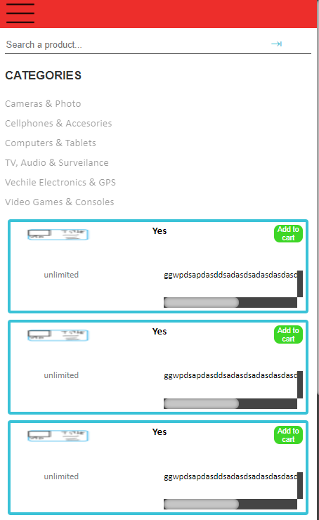
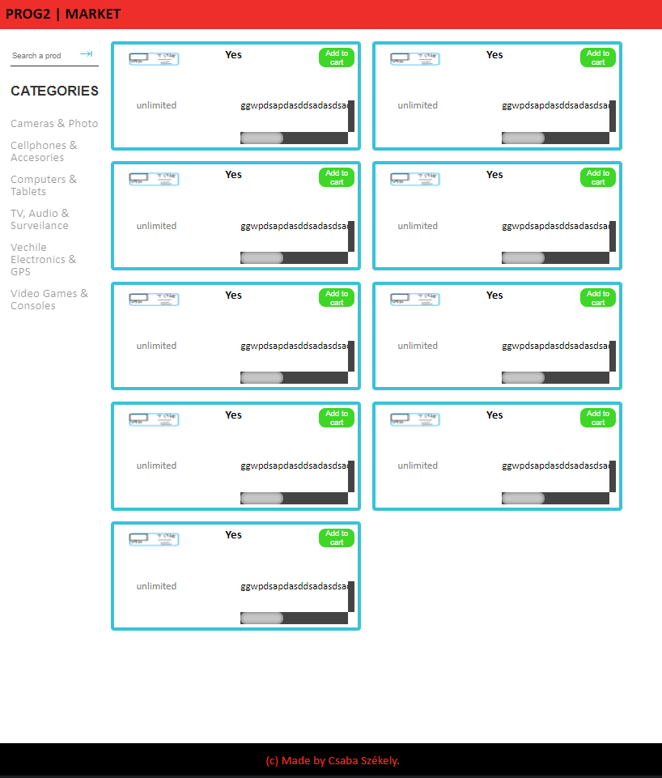
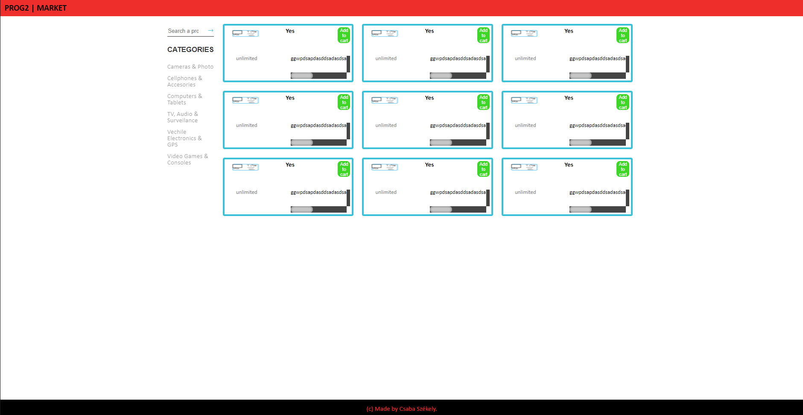

Project Webshop
===============

Made by: Csaba Székely
**********************
Chosen tools: css,js(es5,node_js)
*********************************

Responsive views supported(mobile,tablet,desktop)
*************************************************

## Mobile


<p>&nbsp;</p>

## Tablet


<p>&nbsp;</p>

## Desktop


<p>&nbsp;</p>


To run the server use the following command in main directory(express,bcrypt has to be installed by using ***npm install express/bcrypt***):
*******************************************************************************
```
node server.js
```
